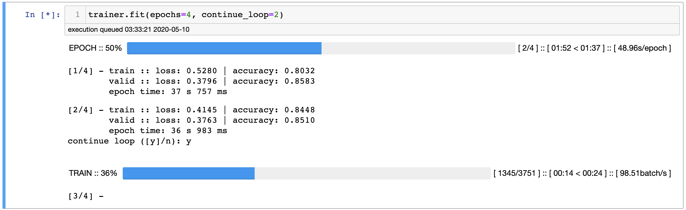
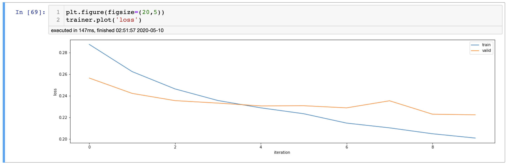

<h1 style="text-align:center"><code>➰ fitloop </code></h1>
<p style="text-align:center"><code>fitloop</code> trains Pytorch models</p>

---
# What's `fitloop`
`fitloop` is a substitute to having to write the  boilerplate code pertaining to the training loop with some added niceties.

## Installation
```shell
$ pip install fitloop
```

## Sample
Training a model using `fitloop` for 10 epochs.
```python
from fitloop import FitLoop

def configure_optimizer(floop):
    floop.optimizer.param_groups.clear()
    floop.optimizer.add_param_group({
        'params':floop.model.parameters()
    })

params = model.parameters()

fdict = {
    "model": model,
    "loss_function": nn.CrossEntropyLoss(),
    "optimizer": Adam(params),
    "train_dl": train_dl,
    "configure_optimizer": configure_optimizer
}

trainer = FitLoop(**fdict)
trainer.fit(epochs=10)
```
## Demo 
COLAB Links for training a simple CNN on FashionMNIST.
- [Simple Usage](https://colab.research.google.com/drive/1Ez21_lBHcvBZdChieTxLb6rqR-5U6ppi?usp=sharing)
- [Usage](https://colab.research.google.com/drive/1KyfnynLEiZo2YXcMuDhF3wVcJgANUj2F?usp=sharing)
---

# Intro
## Stages
A training loop can be divided into stages. Here it has been divided into three.
1. Batch Step
    - This is the stage where forward pass occurs `model(X)`.
    - If the loop is in `train` phase then `loss.backward` and `optimizer.step` have to be called.
2. Epoch End
    - Stage at the end of the loop where metrics for model evaluation are calculated.
3. Epoch Start
    - Stage at the start of the loop where (if required) pretrain initializations can be executed.

## Phases
Model training and evaluation consists of three phases.
1. Training 
2. Validation
3. Testing

Each of the three *phases* can have their own distinct *stages* where different or same computations are performed.

This is what `fitloop` let's you do i.e. define the stage functions for the three phases.
Besides this most can be handled by `fitloop`
If the use case is simple then even this is not required, there are predefined stage functions that will work for simple use cases.

**Examples**
- For a simple example check out [Basic Usage.ipynb](https://github.com/18alantom/fitloop/blob/master/examples/Basic%20Usage.ipynb)
- For a more comprehensive example showcasing more of `fitloop`s features check out [Usage.ipynb](https://github.com/18alantom/fitloop/blob/master/examples/Usage.ipynb)

---
# Setup
For the most basic usage of `fitloop`  the few things that need to be defined are.
- `model` - the Pytorch [model](https://pytorch.org/docs/stable/nn.html#module) that needs to be trained.
- `optimizer` - Pytorch [optimizer](https://pytorch.org/docs/stable/optim.html#torch.optim.Optimizer) that is used to optimize the model.
- `loss_function` - A [loss](https://en.wikipedia.org/wiki/Loss_function) [function](https://pytorch.org/docs/stable/nn.html#crossentropyloss) for computing.. you guessed it, loss.
- `configure_optimizer` - A function that is used to configure the optimizer parameters so that the model is ready to train when it is loaded or restored.
- `train_dl` - [DataLoader](https://pytorch.org/docs/stable/data.html#torch.utils.data.DataLoader) for training the model.

For extending the usage beyond basic a few more additional components are required.
- `valid_dl` - [DataLoader](https://pytorch.org/docs/stable/data.html#torch.utils.data.DataLoader) for validation of the model.
- `test_dl` - [DataLoader](https://pytorch.org/docs/stable/data.html#torch.utils.data.DataLoader) for testing the model.
- *stage functions* - A set of functions that are called at different stages throughout the loop.
- `criteria` - name of the validation criteria that is used to evaluate the model, this is a value that is returned from the state dict.


## Configure Optimizer
```python
configure_optimizer(floop:FitLoop) -> None
```
- This function is required so that when the model is reset
  to it's last best state during training the optimizer parameter groups can be reset.
- If this function isn't set, `FitLoop.optimizer` parameter groups will have to be set
  manually, else the weights won't update on further training.
- Model weights are reset:
    - After training if `load_best` arg is `True` in the `FitLoop.fit` function.
    - When `FitLoop.reset` is called.
    - When `FitLoop.run_sanity_check` or `FitLoop.run_profiler` are called.
- `configure_optimizer` can be called using `FitLoop.configure_optimizer`.

## Stage Functions
There are nine stage functions (three for each of the three phases) that are called in the loop.
```python
phase_stagefunction(state:LoopState) -> Dict[str,float]
```
### BatchStep
- `train_step` - should call `loss.backward` and `optimizer.step` and return metrics to be tracked.
- `valid_step`, `test_step` - should return metrics to be tracked.
- `test_step` - should return metrics to be tracked.
### Epoch End Step
- `train_epoch_end`, `valid_epoch_end`,`test_epoch_end` - calculate required metrics such as `loss` from values returned in the batch step.
### Epoch Start Step
- `train_epoch_start`, `valid_epoch_start`,`test_epoch_start` - Can be used for initilizations.


### Example stage functions
Batch Step stage function for train phase
```python
def train_step(state):
    X, y = state.batch
    y_ = state.model(X)

    loss = state.loss_function(y_, y)

    # Calculate gradients and backprop
    loss.backward()
    state.optimizer.step()

    running_loss = loss.item() * state.batch_size
    running_corr = (y_.argmax(dim=1)==y).sum().float().item()

    return {
      "running_loss": running_loss,
      "running_corr": running_corr
    }
```

Epoch End Step stage function for train phase
```python
def train_epoch_end(state):
    # Values returned are pytorch Tensors
    running_losses = state['running_loss']
    running_corrs = state['running_corr']

    # state.size : number of samples in the dataset
    loss = running_losses.sum().item() / state.size
    accuracy = running_corrs.sum().item() / state.size

    return {
      "loss": loss,
      "accuracy": accuracy
    }
```

## Creating a `fitloop` trainer
Once all the components have been set up a `fitloop` trainer can be set up like so
```python
fdict = {
    "model":model,
    "loss_function":loss_function,
    "optimizer":optimizer,
    
    # DataLoaders
    "train_dl":train_dl,
    "valid_dl":valid_dl,
    "test_dl":test_dl,
    
    # Batch Step Stage Functions
    "train_step":train_step,
    "valid_step":valid_step,
    "test_step":test_step,
    
    # Epoch End Stage Functions
    "train_epoch_end": train_epoch_end,
    "valid_epoch_end": valid_epoch_end,
    "test_epoch_end": test_epoch_end,
    
    # Model Evaluation
    "criteria": "accuracy", # Returned in valid_epoch_end stage function dict
    
    # Model Preservation
    "save_to_disk": True # Will save pretrained and best model to disk

    # Param Restoration/Update
    "configure_optimizer":configure_optimizer,
}

trainer = FitLoop(**fdict)
```
---
# Usage
## Training
model can be trained using `FitLoop.fit`, in the below example the model is being trained for 4 epochs, after every 2 epochs it will ask whether to continue training.


## Metrics
All metrics returned from the stage functions can be accessed using `FitLoop.M` 

`FitLoop.plot(metric_name)` can be used to plot the required metrics that have been returned from the `train_epoch_end` and `valid_epoch_end` stage functions.


## Testing
Calling `FitLoop.test()` will run the loop in test mode ie for one epoch with the stage functions defined for testing.

---

For additional functionalities such as loading and restoring models, resetting, sanity checks, profiler check [Usage.ipynb](https://github.com/18alantom/fitloop/blob/master/examples/Usage.ipynb)